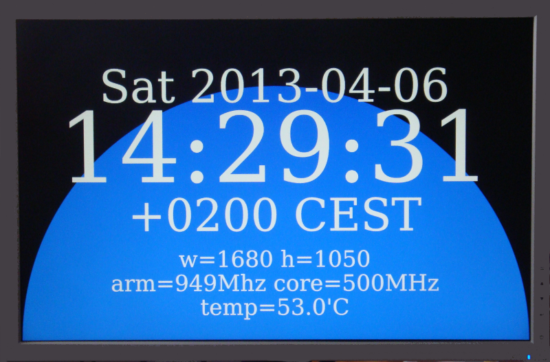

[wiki](https://github.com/capnm/go_rpi/wiki/)
[Go](http://golang.org/)
[RPi](http://www.raspberrypi.org/)
# A simple 2D graphics system for the Raspberry Pi.

### At first install the Go language and the jpeg library.
(type that line by line in the terminal)
```
sudo apt-get install libjpeg8-dev git

wget https://github.com/golang/go/archive/go1.4.2.tar.gz
sudo tar xf go1.4.2.tar.gz -C /opt/
sudo mv /opt/go-go1.4.2 /opt/go
sudo chown -R $USER /opt/go

# compile Go
cd /opt/go/src
./make.bash 
# wait a few minutes

# set correct permissions and make the Go language available in the terminal 
sudo chown -R root:root /opt/go
sudo -i
cd /usr/bin
ln -s /opt/go/bin/go
ln -s /opt/go/bin/gofmt
exit

# and test Go:
go version
--> go version go1.4.2 linux/arm

```

### Install this repository
```
git clone git://github.com/capnm/go_rpi.git

cd go_rpi
export GOPATH=$(pwd)
```

# Examples
### To check if everything works, run the blue circle program:
Run `bin/circle` in the x11 terminal or remote over ssh or in the linux console (ctrl+alt+F1).
You can rebuild the binary with `go install -v circle`.

### A simple clock displaying some hardware data:
Run `bin/clock`.
Rebuild it with `go install -v clock`




# Gotchas
'error: failed to add service - already in use?' or some EGL error message:

	edit /boot/config.txt and make sure that the minimum video ram size (gpu_mem=64) is 64mb


# Credits 
* The original OpenVG code was copied from the [ajstarks openvg](https://github.com/ajstarks/openvg) repository.
